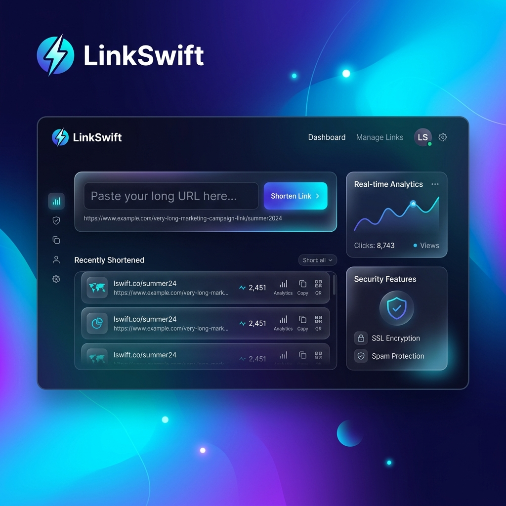

# LinkSwift - Premium URL Shortener API

LinkSwift is a production-grade URL shortener service built using Flask and SQLAlchemy. It enables low-latency redirection, idempotent URL generation, and real-time analytics, designed with backend engineering best practices.

## 🚀 Features
- **Fast Lookups**: Indexed database queries for near-instant redirection.
- **Idempotent API**: Reuses existing short codes for duplicate long URLs.
- **Atomic Analytics**: Transaction-safe click tracking to ensure data consistency.
- **URL Expiration**: Optional expiration dates for temporary links.
- **Premium UI**: Modern, responsive design with glassmorphism effects.
- **Rate Limiting**: Integrated protection against API abuse.

## 🛠️ Tech Stack
- **Backend**: Python, Flask
- **Database**: SQLite (SQLAlchemy ORM)
- **Frontend**: HTML5, CSS3 (Modern Vanilla)
- **Configuration**: Environment variables (.env)

## 📦 Installation & Setup

1. **Clone the repository**:
   ```bash
   git clone <your-repo-url>
   cd url-shortener
   ```

2. **Create a virtual environment**:
   ```bash
   python -m venv venv
   source venv/bin/activate  # On Windows: venv\Scripts\activate
   ```

3. **Install dependencies**:
   ```bash
   pip install -r requirements.txt
   ```

4. **Setup Environment Variables**:
   Create a `.env` file in the root directory:
   ```env
   SECRET_KEY=your-secret-key
   DATABASE_URL=sqlite:///url_shortener.db
   PORT=5000
   ```

5. **Run the application**:
   ```bash
   python run.py
   ```

## 🧪 Testing
Run the automated test suite to verify the logic:
```bash
python test_api.py
```

## 📜 API Endpoints
- `POST /shorten`: Create a short URL (JSON: `{"url": "...", "expires_in_days": 7}`)
- `GET /<short_code>`: Redirect to original URL.
- `GET /analytics/<short_code>`: Retrieve click data and timestamps.

## 🖼️ UI Preview


## 📄 License
This project is open-source and available under the [MIT License](LICENSE).
